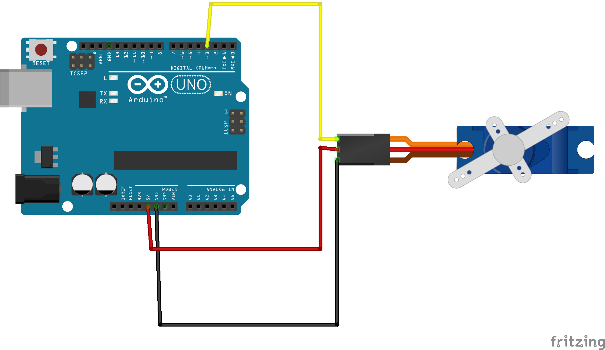

### 1_Servo_Simpel

Dit voorbeeld laat zien hoe je een servo-motor kan aansluiten op een Arduino-bord. De servo draait in een vast tempo heen en weer tussen 0 en 180 graden. 

1. Open het voorbeeld 1_Servo_Simpel.ino in de Arduino IDE
2. Installeer de Servo library door naar het menu: Sketch > Include Library > Manage Libraries... te gaan en te zoeken op 'Servo'. Klik op Install bij 'Servo by Michael Margolis, Arduino'. 
3. Sluit de servo-motor aan op de Arduino volgens het bedradingsschema hieronder. 
4. Upload het voorbeeld naar de Arduino.
5. De servo-motor begint nu te bewegen.

### Servo

Een servo is een motortje dat beweegt naar een bepaalde positie en daar blijft staan. Je stuurt hem aan door te zeggen waar hij naartoe moet, niet hoe hard of hoe lang hij draait. In ons voorbeeld beweegt de servo steeds heen en weer tussen twee uiterste posities: 0 en 180 graden.

Servo's worden veel gebruikt in robotica en modelbouw, omdat ze nauwkeurig te positioneren zijn.