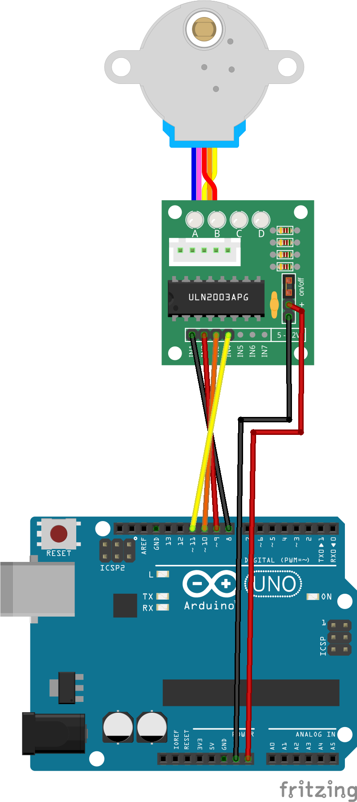

### 2_Stepper_heen_en_terug

Dit voorbeeld laat zien hoe je een stepper-motor kan aansluiten op een Arduino-bord. De stepper kan worden aangestuurd door signalen naar de Arduino te sturen.

1. Open het voorbeeld in het mapje Code/2_Stepper_heen_en_terug/2_Stepper_heen_en_terug.ino
2. Sluit de stepper-motor en ULN2003-driver aan op de Arduino volgens het bedradingsschema.
3. Upload het voorbeeld naar de Arduino.
4. De stepper-motor zal nu een volledige rotatie maken.

### Stepper

Een stappenmotor draait niet continu, maar beweegt in kleine discrete stapjes. Per stap draait hij een vaste hoek: hoe meer stappen, hoe verder hij draait. Dat maakt hem voorspelbaar en nauwkeurig, je weet precies hoeveel hij beweegt en hoe snel.
Ze worden gebruikt in CNC-machines, 3D-printers en plotters. Overal waar een gecontroleerde, herhaalbare beweging nodig is.