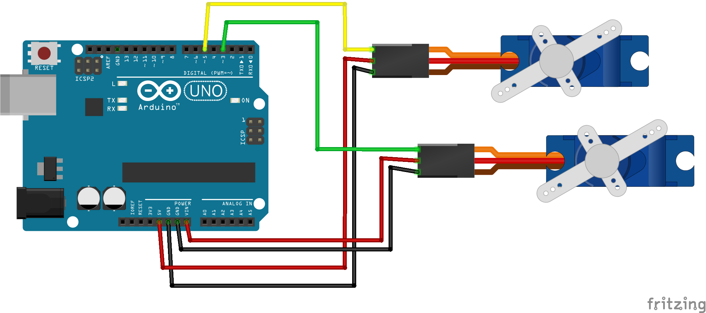

### 4_Servo_Double

In dit laatste voorbeeld laat zien hoe je twee servo-motoren kan aansluiten op een Arduino-bord en ze onafhankelijk van elkaar kan laten bewegen. 

1. Open het voorbeeld in het mapje Code/4_Servo_Double/4_Servo_Double.ino
2. Sluit de servo-motoren aan op de Arduino volgens het bedradingsschema.
3. Upload het voorbeeld naar de Arduino.
4. De servo-motoren beginnen nu te bewegen.

