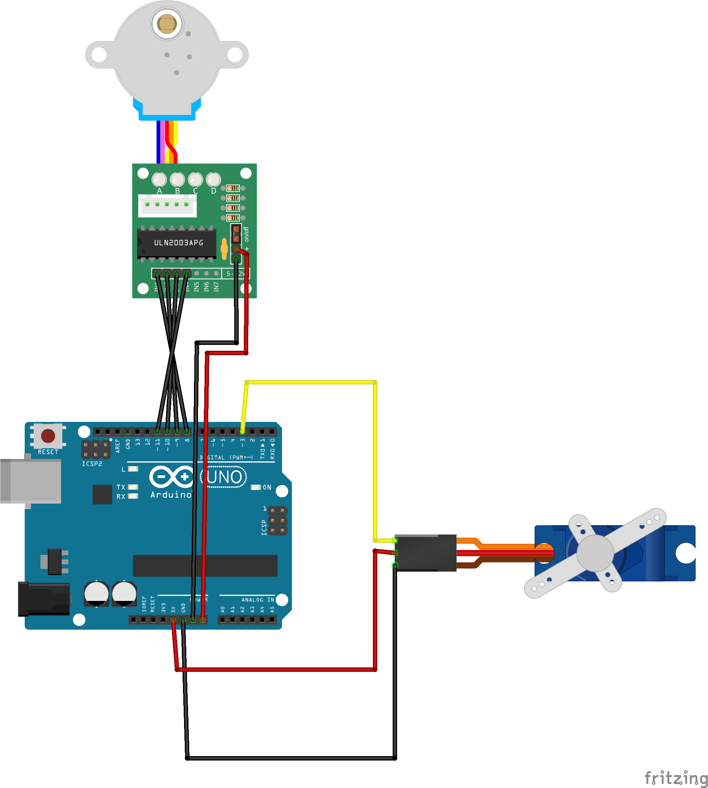

# Drawing Machines  

Vandaag maken we een prototype voor een tekenmachine. Op tafel liggen Arduino's, motoren en materialen. Alle Arduino's zijn al geprogrammeerd, sluit een motor (correct) aan en hij beweegt.

Alle Arduino's draaien [voorbeeld 3: Stepper en Servo](./Code/3_Stepper_en_Servo/README.md). Je kan twee motoren aansluiten: een servo die 180 graden heen en weer beweegt, en een stappenmotor die op een vast tempo rondjes draait. Hou er rekening mee dat de motoren niet heel sterk zijn en geen zware machines kunnen aandrijven. Sluit de draden exact zo aan als op het plaatje hieronder. De kleuren van de draden maken niet uit, als ze maar in het juiste gaatje gaan!

Sluit de motoren aan volgens het schema hieronder en begin te bouwen. Je hoeft niets te downloaden of te installeren.

Bouw met de materialen die ik heb meegenomen, of met wat je zelf vindt. Het enige dat telt is dat de machine beweegt en een spoor achterlaat. Wat dat spoor wordt hangt af van de keuzes die je maakt.

---

*Technische noot: we gebruiken vandaag de stroomvoorziening van de Arduino zelf. In een uitgewerkt project gebruik je een aparte voeding voor de motoren.*

## De techniek

Arduino is een kleine computer die je kunt programmeren om verschillende taken uit te voeren. Het is een handig hulpmiddel om elektronische projecten te maken, zoals robots, sensoren en andere interactieve apparaten. Met Arduino kun je sensoren en motoren aansturen en input van verschillende bronnen verwerken om bepaalde acties uit te voeren. Het wordt vaak gebruikt door hobbyisten, studenten en professionele ontwikkelaars vanwege de flexibiliteit en de gemakkelijke manier waarop je ermee kunt experimenteren en prototypen kunt maken.

Vandaag gebruiken we de Arduino met twee types makkelijk te gebruiken motoren. 

*opmerking* om het allemaal zo makkelijk mogelijk te maken gebruiken we vandaag de voeding (stroom) van de Arduino. Dat wordt niet aanbevolen en kan storing in de Arduino veroorzaken (brownouts) of potentieel de Arduino beschadigen. In een 'echt' project zullen we dit anders moeten oplossen dmv een aparte voeding voor de motors.

## Stappenplan Arduino software installeren. 

1. Download en installeer de [Arduino IDE](https://www.arduino.cc/en/software)
2. Sluit de Arduino aan op de computer via de USB-kabel.
3. Download de voorbeelden van [Github](https://github.com/heerko/Drawing_Machines), door op de pagina rechtsboven op [<>Code] te klikken en daarna op [[Download Zip](https://github.com/heerko/Drawing_Machines/archive/refs/heads/main.zip)]. Je hebt daarna een zip bestand met alles wat op de github pagina ziet. 
4. Open de voorbeelden. In elke map zit een bestand met Arduino Code, een beschrijving voor hoe het aangesloten moet worden en andere uitleg. 
5. Upload de code naar de Arduino. 
6. Probeer de voorbeelden uit en maak een plan met je groepje wat er moet gebeuren van deze bewegende onderdelen een tekenmachine te maken.
7. De opdracht: Maak met deze materialen een simpele tekenmachine. Je mag de progammatjes aanpassen, meerdere motors toevoegen, materialen zoeken/gebruiken
8. Leg de uitkomsten vast! Maak foto's of video's. Bewaar de tekeningen.
9. Opruimen. Breek je machine weer af en berg alles weer op zoals je het hebt gepakt. Sorry :)

## Voorbeelden

## Andere voorbeelden

**[1. Servo simpel](./Code/1_Servo_Simpel/README.md)**
Één servo, heen en weer.

**[2. Stepper heen en terug](./Code/2_Stepper_heen_en_terug/README.md)**
Alleen een stappenmotor, in vaste stappen.

**[3. Stepper en servo](./Code/3_Stepper_en_Servo/README.md)**
Beide motoren tegelijk. Dit is het voorbeeld dat al op de Arduino's staat. 

**[4. Servo double](./Code/4_Servo_Double/README.md)**
Twee servo's, onafhankelijk van elkaar.

## Conclusie

Dit zijn slechts een paar voorbeelden van wat je met een Arduino-bord kan doen. Er zijn veel meer mogelijkheden, afhankelijk van wat je wilt bereiken. Met behulp van de Arduino IDE en de juiste bibliotheken kan je vrijwel elk project maken dat je maar kan bedenken.