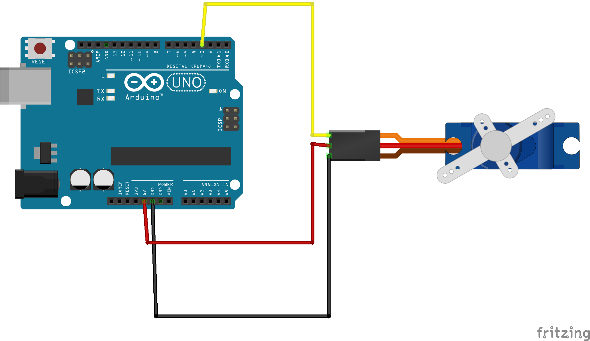
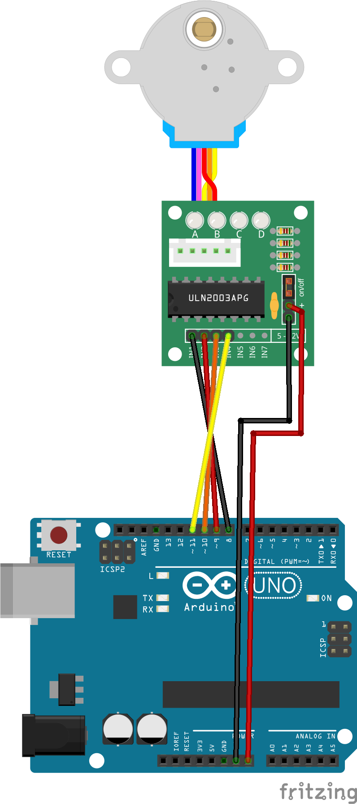
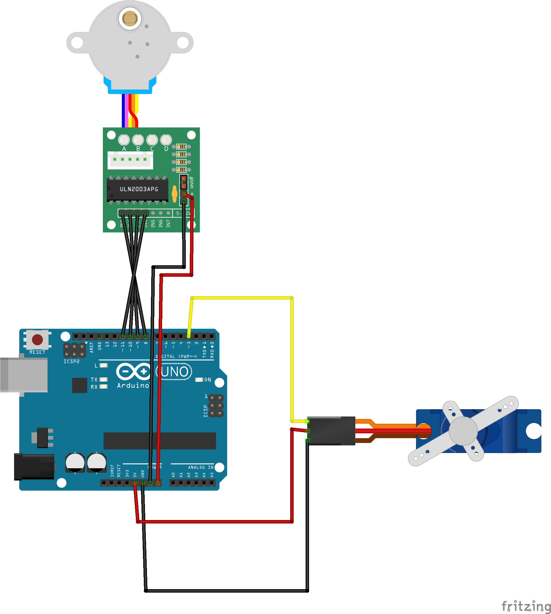
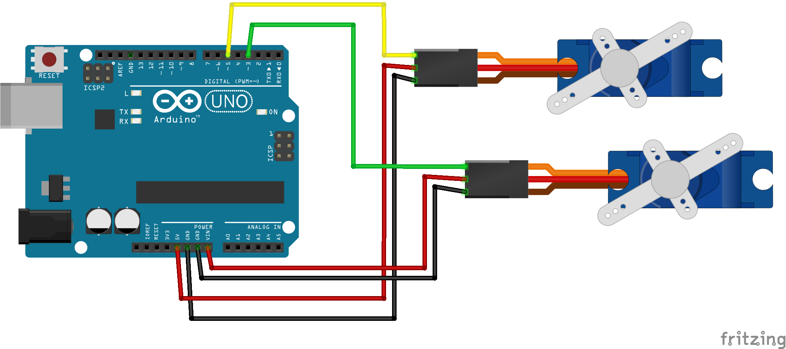
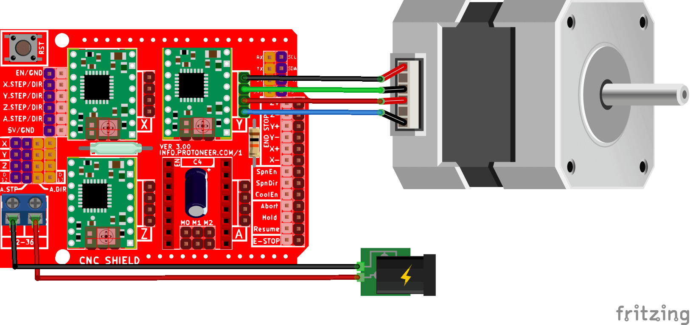

## Stappenplan

1. Download en installeer de [Arduino IDE](https://www.arduino.cc/en/software)
2. Sluit de Arduino aan op de computer via de USB-kabel.
3. Download de voorbeelden van [Github](https://github.com/heerko/Drawing_Machines), door op de pagina rechtsboven op [<>Code] te klikken en daarna op [[Download Zip](https://github.com/heerko/Drawing_Machines/archive/refs/heads/main.zip)]. Je hebt daarna een zip bestand met alles wat op de github pagina ziet. 
4. Open de voorbeelden. In elke map zit een bestand met Arduino Code, een beschrijving voor hoe het aangesloten moet worden en andere uitleg. 
5. Upload de code naar de Arduino. 
6. Probeer de voorbeelden uit en maak een plan met je groepje wat er moet gebeuren van deze bewegende onderdelen een tekenmachine te maken.
7. De opdracht: Maak met deze materialen een simpele tekenmachine. Je mag de progammatjes aanpassen, meerdere motors toevoegen, materialen zoeken/gebruiken
8. Leg de uitkomsten vast! Maak foto's of video's. Bewaar de tekeningen.
9. Opruimen. Breek je machine weer af en berg alles weer op zoals je het hebt gepakt. Sorry :)

## De techniek

Arduino is een kleine computer die je kunt programmeren om verschillende taken uit te voeren. Het is een handig hulpmiddel om elektronische projecten te maken, zoals robots, sensoren en andere interactieve apparaten. Met Arduino kun je sensoren en motoren aansturen en input van verschillende bronnen verwerken om bepaalde acties uit te voeren. Het wordt vaak gebruikt door hobbyisten, studenten en professionele ontwikkelaars vanwege de flexibiliteit en de gemakkelijke manier waarop je ermee kunt experimenteren en prototypen kunt maken.

Vandaag gebruiken we de Arduino met twee types makkelijk te gebruiken motoren. 

*opmerking* om het allemaal zo makkelijk mogelijk te maken gebruiken we vandaag de voeding (stroom) van de Arduino. Dat wordt niet aanbevolen en kan storing in de Arduino veroorzaken (brownouts) of potentieel de Arduino beschadigen. In een 'echt' project zullen we dit anders moeten oplossen dmv een aparte voeding voor de motors.

### Servo

Een servo is een apparaat dat wordt gebruikt om een mechanisme of object op een bepaalde positie te houden of te verplaatsen. Het werkt door middel van een elektrische motor die is aangesloten op een sensor die de positie van het mechanisme of object meet. Wanneer de sensor detecteert dat het mechanisme of object niet op de juiste positie is, past de motor de positie aan totdat deze weer op de gewenste positie is.

De positie van de servo kan worden gecontroleerd door een speciale puls naar de besturingspin van de servo te sturen. Door de pulsbreedte van deze puls te variëren, kan de positie van de servo worden gewijzigd. Servo's worden veel gebruikt in robotica, modelbouw en andere toepassingen waar precisiepositionering vereist is.

### Stepper

Een stepper, kort voor stepper motor, is ook een motor die wordt gebruikt om een mechanisme of object te verplaatsen, maar het werkt anders dan een servo. Een stepper gebruikt elektrische impulsen om een motor aan te sturen die in kleine stapjes draait, waardoor het mechanisme of object in kleine stapjes beweegt. Het aantal impulsen dat wordt gegeven, bepaalt hoeveel stappen de motor draait en dus hoeveel het mechanisme of object beweegt. Dit maakt het mogelijk om nauwkeurige bewegingen te maken en bijvoorbeeld ook om de snelheid van de beweging te regelen.

Stepper motoren worden vaak gebruikt in toepassingen waar precisiepositionering en -besturing vereist is, zoals CNC-machines, 3D-printers, robotica en andere geautomatiseerde systemen. Ze kunnen nauwkeurig worden gepositioneerd en gestuurd, en bieden een hoog koppel in verhouding tot hun grootte.

## Voorbeelden

### 1_Servo_Simpel

Dit voorbeeld laat zien hoe je een servo-motor kan aansluiten op een Arduino-bord. De servo kan worden bediend door een signaal naar de Arduino te sturen.

1. Open het voorbeeld in het mapje Code/1_Servo_Simpel/1_Servo_Simpel.ino
2. Sluit de servo-motor aan op de Arduino volgens het bedradingsschema.
3. Upload het voorbeeld naar de Arduino.
4. De servo-motor begint nu te bewegen.

### 2_Stepper_heen_en_terug

Dit voorbeeld laat zien hoe je een stepper-motor kan aansluiten op een Arduino-bord. De stepper kan worden aangestuurd door signalen naar de Arduino te sturen.

1. Open het voorbeeld in het mapje Code/2_Stepper_heen_en_terug/2_Stepper_heen_en_terug.ino
2. Sluit de stepper-motor en ULN2003-driver aan op de Arduino volgens het bedradingsschema.
3. Upload het voorbeeld naar de Arduino.
4. De stepper-motor zal nu een volledige rotatie maken.

### 3_Stepper_en_Servo

Dit voorbeeld laat zien hoe je zowel een servo- als een stepper-motor kan aansluiten op een Arduino-bord. 

1. Open het voorbeeld in het mapje Code/3_Stepper_en_Servo/3_Stepper_en_Servo.ino
2. Sluit de servo-motor, stepper-motor en ULN2003-driver aan op de Arduino volgens het bedradingsschema.
3. Upload het voorbeeld naar de Arduino.
4. De servo-motor zal heen en weer bewegen en de stepper-motor zal één stap maken.

### 4_Servo_Double

In dit laatste voorbeeld laat zien hoe je twee servo-motoren kan aansluiten op een Arduino-bord en ze onafhankelijk van elkaar kan laten bewegen. 

1. Open het voorbeeld in het mapje Code/4_Servo_Double/4_Servo_Double.ino
2. Sluit de servo-motoren aan op de Arduino volgens het bedradingsschema.
3. Upload het voorbeeld naar de Arduino.
4. De servo-motoren beginnen nu te bewegen.

### 5_Nema_stepper

Dit voorbeeld laat zien hoe je een NEMA 17 stappenmotor kan aansturen via een CNC Shield V3 op een Arduino Uno. De motor beweegt afwisselend heen en terug over 200 stappen. Deze stepper motors zijn duurder, groter en sterker, maar ook wat lsatiger in gebruik. Ze moeten met een aparte 12 volt voeding. 
	1.	Open het voorbeeld in het mapje Code/5_Nema_stepper/5_Nema_stepper.ino
	2.	Plaats het CNC Shield V3 op de Arduino Uno.
	3.	Plaats een A4988 driver in de X-socket van het CNC Shield (als dat nog niet gebeurt is), LET OP DE POSITIE VAN DE _"EN"_ PIN!
	4.	Sluit de NEMA 17 stappenmotor aan op de X-uitgang van het CNC Shield.
	5.	Sluit een externe voeding (bijv. 12V) aan op het CNC Shield voor de motorvoeding.
	6.	Upload het voorbeeld naar de Arduino.
	7.	De motor zal nu 200 stappen vooruit en vervolgens 200 stappen terug bewegen.

Let op:
	•	Stel de stroomlimiet van de driver correct in met een schroevendraaier.
	•	Zorg voor een koelblokje op de driver.
	•	De microstepping kan worden ingesteld met jumpers onder de driver (optioneel).

(afbeelding van https://www.aranacorp.com/en/using-an-arduino-cnc-shield-v3/)

## Conclusie

Dit zijn slechts een paar voorbeelden van wat je met een Arduino-bord kan doen. Er zijn veel meer mogelijkheden, afhankelijk van wat je wilt bereiken. Met behulp van de Arduino IDE en de juiste bibliotheken kan je vrijwel elk project maken dat je maar kan bedenken.